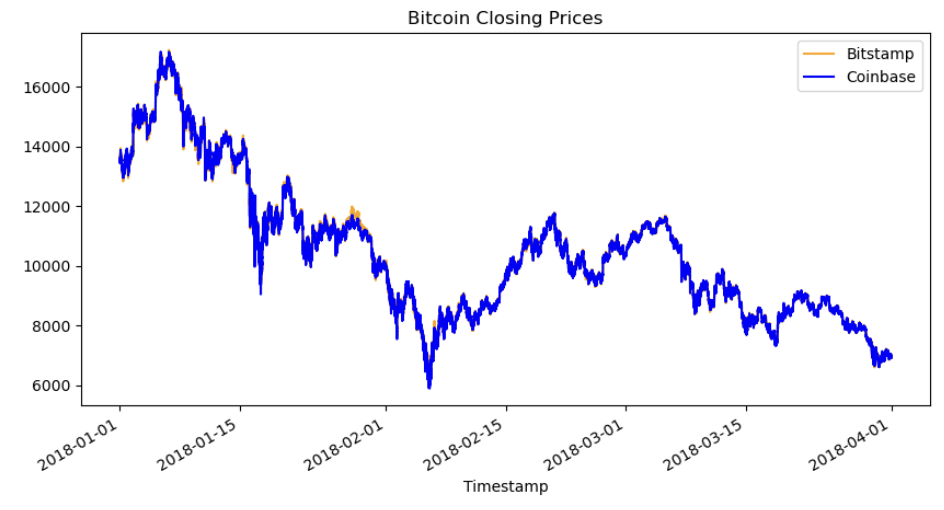
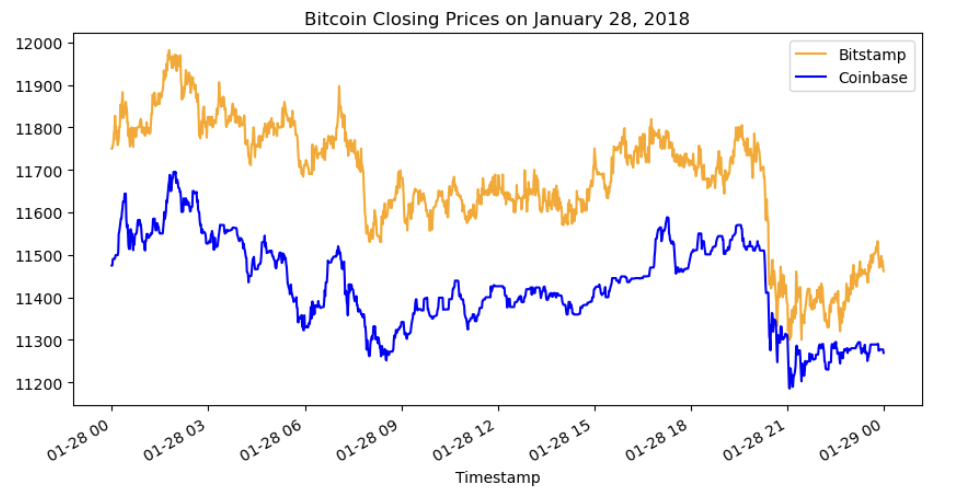
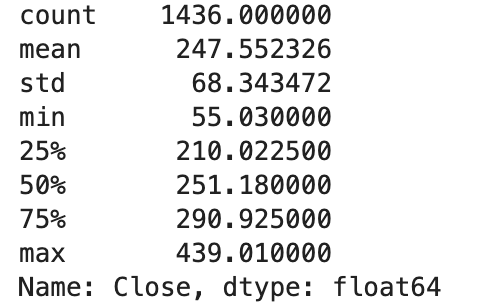
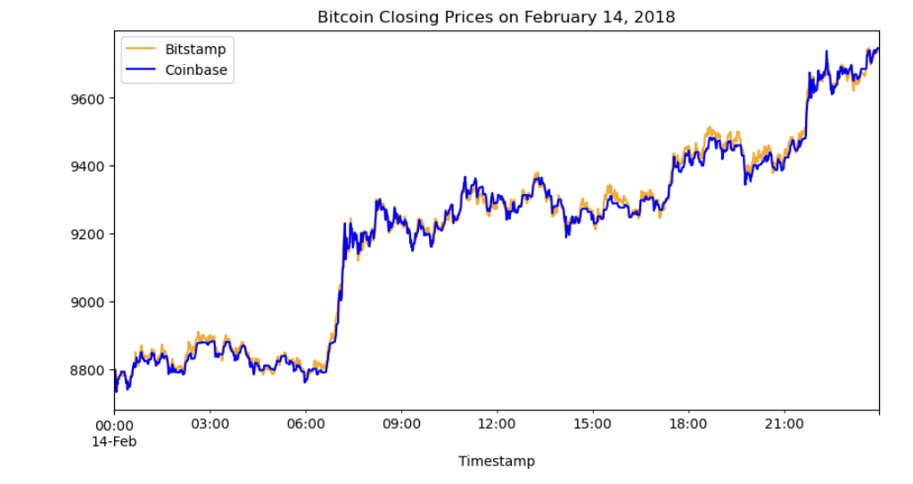
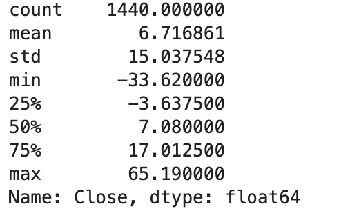
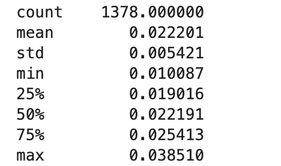
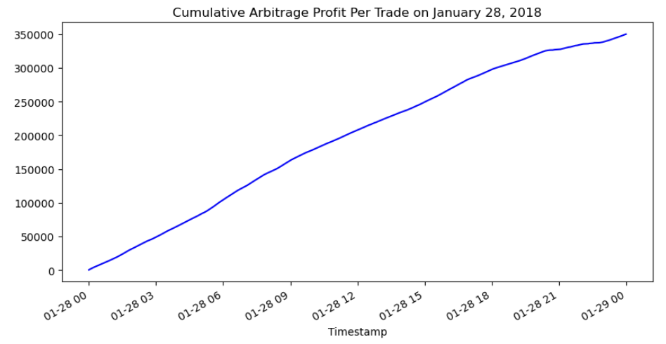

# Module-3-Challenge

This program analyzes two datasets of bitcoin pricing in the first quarter of 2018 from two different bitcoin exchanges (Bitstamp and Coinbase), to see if there was any spread in pricing that would support an **arbitrage trading strategy** (buying bitcoin from one exchange and selling it on another exchange for a higher price to generate a profit).

## Technologies

This program uses python version 3.7 and the `pandas` library.

## Analysis

From the overlay line chart below it's clear that there was a higher degree of spread in Bitcoin pricing in January 2018, evidenced by the orange line separating from the blue line, but that spread quickly declines thereafter.

Looking at a single day in January there is a relatively large spread between bitcoin's price on bitstamp and coinbase. With Bitstamp price $247 above the Coinbase price on average:

However, that spread quickly declines as on February 14th the average spread of the Bitstamp price over the Coinbase price was $6.47

Since the spread gets tighter and tighter overtime the ability to have a profitable arbitrage trade dwindles, because the hurdle for the trade to be profitable is 1% to account for costs related to each transaction.

For example on January 28, 2018 you could have made 1378 profitable trades that would have earned 2.2% on average.

Trading one bitcoin would have yielded a cummulative profit of $35k.

Having a profitable trade thereafter that would get over the 1% threshold was unlikely. On February 14th, 2018 there were 0 trades that yielded more than a 1% return. 
